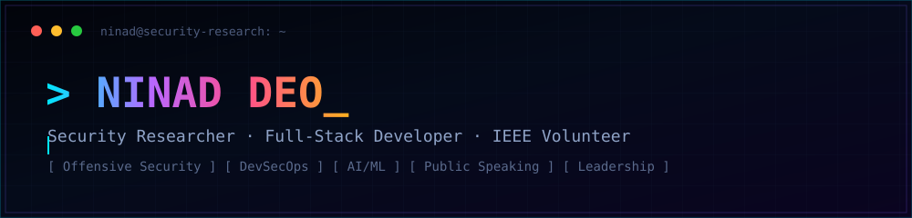
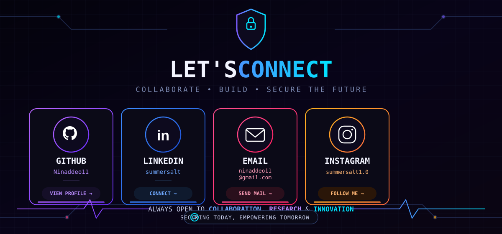

<div align="center">



<br/>


<br/>

[](https://github.com/Ninaddeo11)
[](https://www.linkedin.com/in/summersalt/)
[](mailto:ninaddeo11@gmail.com)
[](https://www.instagram.com/summersalt1.0/)

</div>


## `whoami`

I'm **Ninad**, a security researcher and full-stack developer who moves between offense and defense — building detection tooling one week, breaking things responsibly the next. My work sits at the intersection of **cybersecurity, AI, and public communication**: I write the exploit writeups, and I'm also comfortable being the one presenting them on stage.

```yaml
role:          Security Researcher Intern
programs:      UNESCO x University of Manchester Participant
leadership:    IEEE Student Volunteer · GDG Cybersecurity Lead
also:          Full-Stack Developer · Anchorperson · Blogger & Content Writer
focus:         [Offensive Security, ICS/SCADA Security, AI-assisted SOC tooling, DevSecOps]
currently:     Building EDR + attack-path intelligence tooling (ZORA)
```


## Leadership & Community

<table>
<tr>
<td width="50%" valign="top">

### 🛡️ IEEE Student Volunteer
Active volunteer contributing to technical events, workshops, and outreach within the IEEE student community.

### 🌐 GDG Cybersecurity Lead
Leading the cybersecurity vertical at Google Developer Groups — organizing sessions, CTFs, and awareness drives.

</td>
<td width="50%" valign="top">

### 🎙️ Anchorperson & Public Speaker
Hosting technical and institutional events, comfortable translating deep technical work for a general audience.

### ✍️ Blogger, Content Writer & Social Media Manager
Writing and managing content that bridges security research and accessible tech communication.

</td>
</tr>
</table>

**UNESCO x University of Manchester** — Selected participant, collaborating on cross-institutional academic/research initiatives.


## Featured Projects

<table>
<tr>
<td width="50%">

### 🛡️ [ZORA](https://github.com/Ninaddeo11/ZORA)
**AI-powered EDR platform with attack-path intelligence**

Transforms raw Nmap/OpenVAS scan data into actionable security intelligence — correlating CVEs into probable attack paths, scoring risk with CISA KEV data, and assisting analysts through an AI SOC Copilot while keeping humans in control of remediation.

`TypeScript` `NVD API` `JWT/RBAC` `Attack Path Visualization`

</td>
<td width="50%">

### 🚗 [Drivable Space Segmentation](https://github.com/Ninaddeo11/Drivable-Space-Segmentation)
**Pixel-wise road segmentation for L4 autonomous vehicles**

Custom U-Net CNN (7.7M params) trained from scratch on nuScenes — classifying drivable vs. non-drivable space in real time, including edge cases like grass transitions and construction barriers.

`mIoU 0.9489` · `43+ FPS` · `Python` · `PyTorch`

</td>
</tr>
<tr>
<td width="50%">

### 🏭 [ACDI-ICS](https://github.com/Ninaddeo11/acdi-ics)
**ICS/SCADA security research**

Research and tooling around industrial control system security — anomaly detection and threat modelling for critical infrastructure environments.

`Python` `ICS/SCADA` `Threat Modelling`

</td>
<td width="50%">

### 🤝 [Hack4Humanity Portal](https://github.com/Ninaddeo11/hack4humanity-portal)
**Hackathon platform for social-impact projects**

A Next.js portal built to power submissions, teams, and judging for a humanitarian-focused hackathon.

`Next.js` `TypeScript` `React`

</td>
</tr>
<tr>
<td width="50%">

### 📚 [TRAIN × BRAINCON](https://github.com/Ninaddeo11/TRAIN-BRAINCON)
**Unified academic conference & journal platform**

TRAIN — a journal management system paired with BRAINCON's conference workflow, unified into a single academic operations platform.

`TypeScript` `Full-Stack`

</td>
<td width="50%">

### ⚔️ [KRATOS](https://github.com/Ninaddeo11/Kratos)
**ERP-style operations platform**

A full-stack system project exploring structured operations/ERP workflows end-to-end.

`TypeScript` `Full-Stack`

</td>
</tr>
</table>

<div align="center">

*More at [github.com/Ninaddeo11?tab=repositories](https://github.com/Ninaddeo11?tab=repositories)*

</div>


## Tech Stack

<div align="center">

**Languages**


<br/><br/>

**Frontend & Frameworks**


<br/><br/>

**AI / ML & Backend**


<br/><br/>

**Security & Offensive Tooling**


<br/>

**DevOps & Cloud**


<br/><br/>

**Tools & Platforms**


</div>


## GitHub Analytics

<div align="center">


</div>


## Contribution Snake

<div align="center">

<picture>
  <source media="(prefers-color-scheme: dark)" srcset="https://raw.githubusercontent.com/Ninaddeo11/Ninaddeo11/output/github-contribution-grid-snake-dark.svg"/>
  
</picture>

</div>


<div align="center">



</div>
